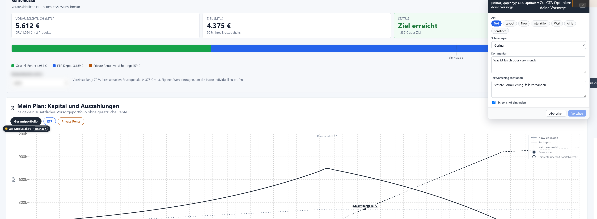

Status: needs-triage
Type: copy
Priority: minor

## Parent

.scratch/qa-feedback-mode/PRD.md
# [Minor] qa(copy): CTA Optimiere deine Vorsorge

| Field | Value |
| --- | --- |
| Type | Copy |
| Severity | Minor |
| Target id | `dashboard.rentenlucke.cta.optimiere` |
| Precision | exact |
| Target label | CTA Optimiere deine Vorsorge |
| Route | / |
| Viewport | 2458×907 |
| Browser | Chrome 147 / Windows |
| App build | dev |
| Timestamp | 2026-05-06T12:38:13.677Z |

## Tester comment

Button renders outside the screen

## Visible text at selection

```
Optimiere deine Vorsorge
```

## Workspace context

- Mode: `combine`
- Active view: `vergleich`

## Privacy flags

- Sensitive fields redacted: **yes**
- User inputs redacted: **yes**
- Scenario state included: **no**
- Screenshot included: **yes**
- localStorage included: **no**

## Screenshot


