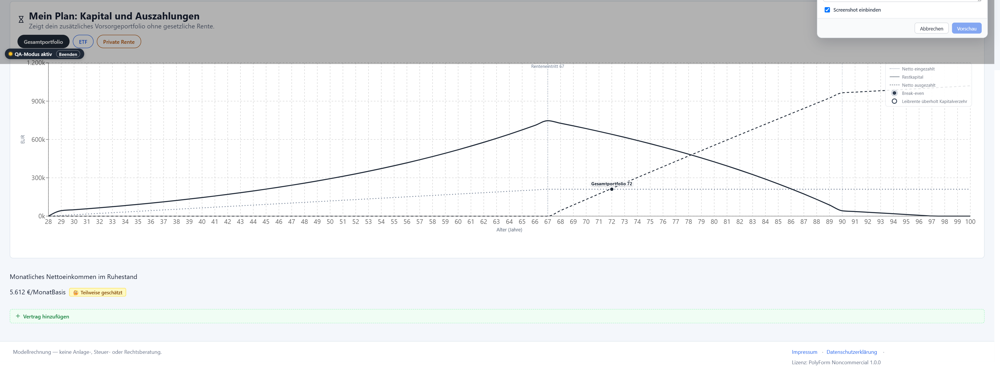

Status: needs-triage
Type: copy
Priority: minor

## Parent

.scratch/qa-feedback-mode/PRD.md
# [Minor] qa(copy): Private Rentenversicherung

| Field | Value |
| --- | --- |
| Type | Copy |
| Severity | Minor |
| Target id | `dashboard.optimiereModal.overview.row.versicherung-bmwzs5bn` |
| Precision | exact |
| Target label | Private Rentenversicherung |
| Route | / |
| Viewport | 2458×907 |
| Browser | Chrome 147 / Windows |
| App build | dev |
| Timestamp | 2026-05-06T13:57:13.994Z |

## Tester comment

Shows programmatic tags and does not explain them well.

## Visible text at selection

```
Private RentenversicherungPrivate Rentenversicherung100 €/MonatBestätigtpre_2005_pav_taxfree_capitalpre_2005_pav_high_garantiezinsHohe KostenGeringe FlexibilitätAngebotsdaten fehlenAnpassen
```

## Workspace context

- Mode: `combine`
- Active view: `vergleich`

## Privacy flags

- Sensitive fields redacted: **yes**
- User inputs redacted: **yes**
- Scenario state included: **no**
- Screenshot included: **yes**
- localStorage included: **no**

## Screenshot


