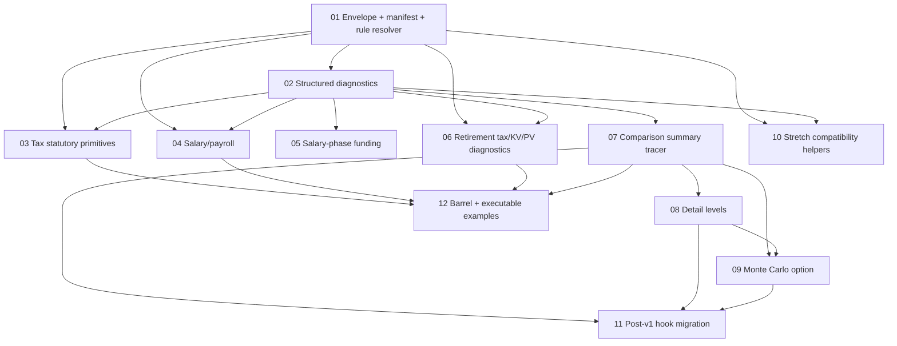

# Implementation Plan - Pure Front-End API Facade

Status: needs-triage
Created: 2026-05-06
Parent: `.scratch/pure-frontend-api/PRD.md`

## Planning Principles

- Keep the API facade pure: no React, DOM, browser storage, fetch, history, clipboard, auth, cookies, telemetry, or backend assumptions.
- Keep calculation behavior unchanged. Existing engine goldens must stay green.
- Prefer small PRs aligned to code ownership. `src/api/**` is the new public boundary; existing `src/engine/**`, `src/app/**`, `src/storage.ts`, and selectors should be consumed, not rewritten.
- Use public API DTOs even when v1 DTO fields mirror internal result types.
- Build the core v1 facade first. Compatibility helpers and React hook migration are explicitly post-core/post-v1.

## Code Ownership Groups

| Group | Issues | Primary Code Area | Notes |
|---|---:|---|---|
| A. API foundation and purity boundary | 01, 02 | `src/api/contracts`, `src/api/manifest`, `src/api/rules`, `src/api/validation`, ESLint/Vitest config | Establishes envelope, rule resolver, manifest, diagnostics, and enforceable no-browser/no-React boundary. |
| B. Tax facade | 03, 04, 05, 06 | `src/api/tax`, `src/api/tax/*.test.ts`, existing `src/engine/{tax,salary,salaryPhaseFunding,retirementTax,retirementPayout,...}` as dependencies | Public DTO wrappers over existing pure engine helpers. No engine behavior changes. |
| C. Comparison summary facade | 07 | `src/api/comparison`, `src/api/resultSummaries`, existing `src/app/syncContributions`, `src/engine/simulate`, selectors | First canonical compare-mode entrypoint. Owns defaults, validation, contribution sync, simulation, selected scenario summaries. |
| D. Comparison expansion | 08, 09 | `src/api/comparison`, `src/api/resultSummaries`, existing `src/engine/monteCarlo` | Adds detail levels and optional Monte Carlo composition after the summary tracer bullet is stable. |
| E. Public surface and executable examples | 12 | `src/api/index.ts`, docs/example tests | Publishes the intended import surface and example table for the core API. |
| F. Deferred compatibility and app migration | 10, 11 | `src/api/compat`, `src/storage.ts` wrappers, later `src/app/useSimulationResult` | Stretch/post-v1. Not needed for first usable API release. |

## Dependency Graph

## Phase Plan

### Phase 1 - Foundation

**Goal:** create the contract spine and make impurity hard to introduce.

Issues:

- `01-api-envelope-manifest-and-rule-resolution.md`
- `02-structured-validation-diagnostics.md`

Touches:

- New `src/api/**` foundation modules.
- Test setup for API tests in Node environment.
- Restricted imports/globals for API purity.
- Product/rules/default discovery through existing registries.

Exit criteria:

- `getManifest`-style entrypoint works.
- API result envelope and diagnostics are stable enough for downstream issues.
- API tests fail fast on React/browser dependency leaks.
- Hybrid validation contract is pinned, including product slot-root errors.

Parallelism:

- 01 must land before 02.
- Do not start downstream facade work until 01's envelope names and 02's diagnostic shape are accepted.

### Phase 2 - Core Facades In Parallel

**Goal:** expose first useful API calls without touching the React app.

Tracks:

1. **Tax facade track**
   - `03-tax-api-core-primitives.md`
   - `04-tax-api-salary-payroll.md`
   - `05-tax-api-salary-phase-funding.md`
   - `06-tax-api-retirement-phase-and-tax-mode-diagnostics.md`

2. **Comparison summary track**
   - `07-comparison-api-summary-tracer-bullet.md`

Touches:

- New `src/api/tax*` modules and tests.
- New `src/api/comparison*` and result-summary modules.
- Existing engine/app modules only as imports.

Exit criteria:

- Tax primitive, salary/payroll, funding, retirement tax/KV/PV operations work through API DTOs.
- Comparison summary facade matches the current UI pipeline for defaults, custom net anchor, custom scenario, and empty visible products.
- Public result entries use array shapes with optional future `instanceId`, not `Record<ProductId, ...>`.

Parallelism:

- 03, 04, 05, 06 can be worked independently after Phase 1.
- 05 can run in parallel with 04 unless 04 deliberately creates shared public salary sub-DTOs.
- 07 can run after 02 and does not need to wait for 05/06 unless implementers choose to reuse DTOs from those issues.

Recommended PR boundaries:

- PR 1: issue 03 only.
- PR 2: issue 04 only.
- PR 3: issue 05 only.
- PR 4: issue 06 only.
- PR 5: issue 07 only.

### Phase 3 - Comparison Expansion

**Goal:** complete the comparison API's response controls.

Issues:

- `08-comparison-api-detail-levels-and-heavy-results.md`
- `09-comparison-api-monte-carlo-option.md`

Touches:

- `src/api/comparison`.
- `src/api/resultSummaries`.
- Existing Monte Carlo engine as an import.

Exit criteria:

- Summary, Standard, and Full detail levels are implemented and tested.
- Heavy row payload inclusion/exclusion is deterministic.
- Monte Carlo composition follows the agreed contract:
  - Summary omits Monte Carlo unless explicitly requested.
  - Standard includes Monte Carlo summaries only.
  - Full includes Monte Carlo yearly bands.
- Same request and seed produce identical Monte Carlo responses.

Parallelism:

- 08 must land before 09 because 09 composes with detail levels.
- 09 can be skipped for a smaller v1 if the core facade needs to ship early, because Monte Carlo is optional.

### Phase 4 - Public Surface And Examples

**Goal:** make the API discoverable and safe to consume.

Issue:

- `12-api-barrel-documentation-and-executable-examples.md`

Touches:

- `src/api/index.ts`.
- Executable `api.examples.test.ts` style examples.
- Documentation that references the tested example table.

Exit criteria:

- Public API barrel exports only intended facade functions and DTOs.
- Examples cover manifest, statutory tax primitive, salary/payroll, retirement tax, and comparison summary simulation.
- Docs clearly say this is a pure TypeScript/browser API, not HTTP/backend.
- Docs flag that detail-level and Monte Carlo examples are follow-up coverage after issues 08/09.

Parallelism:

- Can start after issues 03, 04, 06, and 07.
- Does not need to wait for issues 08/09 unless the team wants example coverage for heavy detail/Monte Carlo in the same release.

### Phase 5 - Deferred/Post-Core

**Goal:** optional compatibility and app adoption after the API is already stable.

Issues:

- `10-pure-compatibility-helpers-for-state-and-share-payloads.md`
- `11-react-comparison-hook-migrates-to-api-facade.md`

Touches:

- `src/api/compat` and storage/share parser wrappers for issue 10.
- `src/app/useSimulationResult` only for issue 11.

Exit criteria:

- Issue 10: saved-state/share payload parsing returns API envelopes and owns legacy equal-cash fallback parity without browser side effects.
- Issue 11: only `useSimulationResult` delegates to the API facade; downstream view-model and derived-view hooks are not refactored.

Parallelism:

- These are not part of core v1.
- Issue 10 can start after Phase 1 if a real consumer appears.
- Issue 11 should wait until issues 07, 08, and 09 are stable and parity-tested.

## Suggested Milestones

| Milestone | Included Phases | Meaning |
|---|---|---|
| M1 Foundation Ready | Phase 1 | API contract, manifest, rule resolver, diagnostics, and purity enforcement are in place. |
| M2 Core API Ready | Phase 2 | Tax facade and comparison summary facade are usable without React or browser side effects. |
| M3 Full Comparison API | Phase 3 | Detail levels and optional Monte Carlo are implemented. |
| M4 Public Consumption Ready | Phase 4 | Barrel exports and executable examples make the API easy to consume. |
| M5 Adoption/Compatibility | Phase 5 | Optional saved-state helpers and React hook migration. |

## Risks And Mitigations

| Risk | Mitigation |
|---|---|
| Product validation duplication drifts from engine validators. | Keep product validators authoritative; API reports slot-root product errors. |
| Internal result types leak as public DTOs. | Each tax/comparison issue explicitly requires API-owned DTOs. |
| `src/api/**` accidentally imports browser/React code. | Phase 1 adds restricted imports/globals and Node-environment API tests. |
| Comparison API diverges from UI numbers. | Issue 07 parity tests cover current app pipeline, including contribution sync. |
| Heavy yearly rows make default responses bulky. | Phase 3 detail levels keep Summary/Standard light. |
| Hook migration destabilizes UI performance. | Defer issue 11 post-v1 and limit scope to `useSimulationResult`. |

## Recommended First Implementation Order

1. Issue 01.
2. Issue 02.
3. Issue 07, to prove the main comparison value early.
4. Issues 03 and 04, to establish tax facade conventions.
5. Issues 05 and 06, to complete Tax Engine breadth.
6. Issues 08 and 09, to finish comparison depth.
7. Issue 12, to publish the consumption surface.
8. Issues 10 and 11 only after a concrete consumer needs them.
